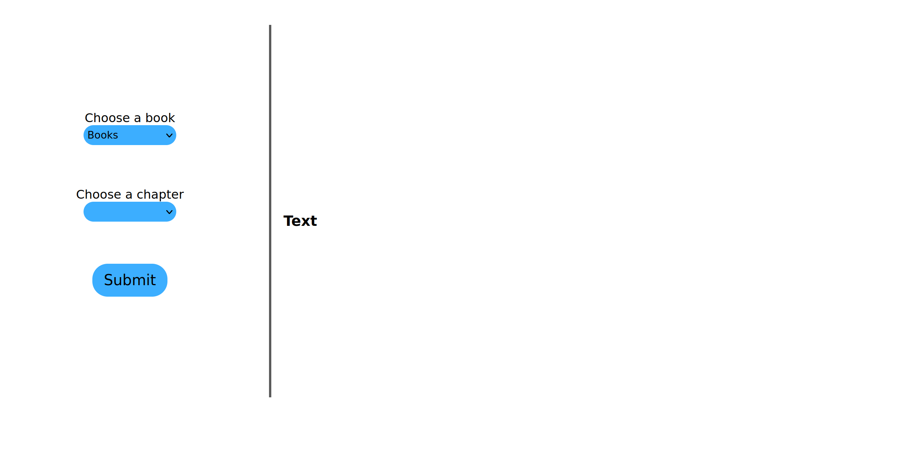
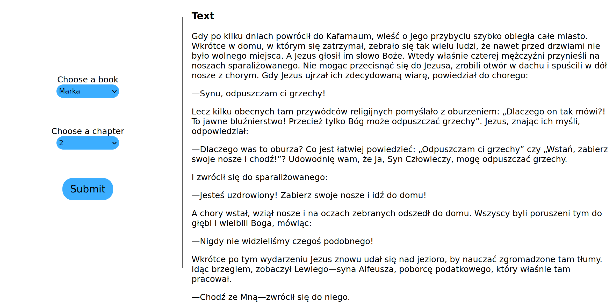

# Polish Bible

You can choose a book and the chapter which is interesting for you and read it.



## Usage

At the begining you must specific a book, then it is possible to choose a chapter. After submiting a form text is downloaded via API and displaied on the screen



## Installation on local machine

```
git init
git clone -b master https://github.com/Krzesimir04/react_bible/
cd react_bible
npm install
npm start
```

## Additional information

- Bible is available only in Polish